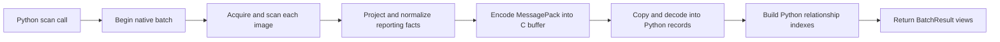

# Architecture and implementation constraints

This document guides agents changing the implementation. User-facing usage and
capabilities belong in [README.md](README.md). The source code is authoritative
for the current API; historical plans and benchmark prototypes can describe
superseded designs.

## Design priorities

Optimize retained reporting memory while keeping the implementation small.
Prefer existing library features over custom serialization, schema tooling, or
object machinery. A roughly 5% memory difference is a flexible tradeoff, not a
hard gate: substantial additional code needs a substantial measured benefit.

The library owns both ends of its native boundary and ships them together.
Backward compatibility with older result schemas is not a requirement. Public
models provide reporting access only: no serialization, deserialization, or
detached materialization API. MessagePack is internal Go-to-Python transport.

## Components and data flow

| Component | Responsibility |
| --- | --- |
| [scanner.py](src/osvpy/scanner.py) | Public typed entrypoints, path conversion, uniform batch options, offline policy |
| [_native.py](src/osvpy/_native.py) | Load the bundled library, serialize admission, call the C ABI, release resources |
| [bridge.go](go/bridge.go) | Registry/archive acquisition, OSV-Scanner invocation, external error classification |
| [report.go](go/report.go) | Owned reporting records and projection of upstream advisory/fix information |
| [store.go](go/store.go) | Batch normalization, value interning, alias grouping, packed relationship rows |
| [wire.go](go/wire.go) | Native handles, MessagePack encoding, owned C output allocation |
| [_schema.py](src/osvpy/_schema.py) | Explicit frozen msgspec record definitions |
| [_store.py](src/osvpy/_store.py) | Eager decoding and one-time construction of relationship indexes |
| [models.py](src/osvpy/models.py) | Read-only indexed views and public relationship navigation |



Scanning is synchronous and sequential. Each input has its own ordered image
slot, including repeated references and failed scans. Acquisition and ordinary
scan failures become failed slots; subsequent inputs continue. Native operation
failures abort the batch.

## Projection and normalization

The upstream scanner graph is projected into records owned by this library.
Only reporting facts are retained: package identity, locations, advisory IDs and
aliases, summaries, timestamp strings, severity vectors and sources, references,
license facts, assessments, and package-specific fix evidence.

Long descriptions, credits, full affected-package catalogs, raw range structures,
and arbitrary extensions are excluded. This bounds result retention independently
of large upstream advisory descriptions. Timestamp strings preserve nanosecond
precision; absent assessment facts remain unknown rather than becoming false.

The batch owns canonical tables for packages, vulnerability groups, source
advisories, contexts, licenses, assessments, and fixes. Images remain distinct.
Occurrences and findings record image-specific relationships between those
tables. Equivalent facts can be shared across images without merging different
locations, source revisions, assessments, or package-specific fixes.

Go interns packages by their comparable identity record. Other retained values
use a shared generic interner: a SHA-256 digest narrows candidates, and comparison
of their JSON encoding confirms equality. JSON here is an internal comparison
representation, not a result format. Advisory pointer memoization is scoped to
one image so it cannot retain upstream graphs across the batch.

Alias grouping uses union/find and prefers CVE identifiers, then lexical order.
A vulnerability group is an identity grouping; a source advisory is a distinct
set of retained evidence. Do not collapse these concepts or infer that all
versions named by related advisories are interchangeable.

Fix evidence is projected for the matched package and ecosystem. Supported
version comparison removes fixes at or below the installed version. Unsupported
ordering remains unknown and preserves reported strings. OS package source
names and distro ecosystem variants participate in matching. These rules report
evidence; they do not select an upgrade or infer universal safety after a fix.

## Wire representation

The transport is **standard MessagePack with an owned normalized payload schema**,
not a handwritten MessagePack codec. Go uses `vmihailenco/msgpack/v5`; Python uses
msgspec typed decoding. There are no custom extension hooks or schema generator.

The payload currently carries ABI marker `4`, schema marker `2`, canonical record
tables, and two binary row fields. Rows contain little-endian unsigned 32-bit
table indexes:

| Field | Columns in order | Bytes per row |
| --- | --- | ---: |
| `occurrences` | image, package, context, license assessment | 16 |
| `findings` | occurrence, source advisory, fix evidence, assessment, vulnerability group | 20 |

MessagePack's native binary type carries these bytes directly. Packing avoids
allocating a Python row object and multiple Python integers per relationship.
The same compact representation survives decoding; it is not immediately
expanded into another graph.

Go uses its JSON field tags for the MessagePack encoder. Empty report collections
and row buffers are omitted; Python record defaults supply empty tuples/bytes.
Required nullable fields remain explicit. Change Go records and Python types
together when changing this schema.

The small batch configuration travels from Python to Go as JSON. Each image input
travels as UTF-8 bytes with an explicit length, preserving embedded NULs for the
external parser/filesystem to handle. Requests stay typed within Go; there is no
internal request JSON round trip.

## Native lifetime and ownership

1. `osv_batch_begin` creates a `runtime/cgo.Handle` for the batch builder.
2. Each `osv_batch_add` acquires, scans, and projects one image.
3. `osv_batch_finish` finalizes normalization and encodes into a C allocation.
4. Python copies that buffer, decodes records, and builds indexes.
5. Python's `finally` releases the C buffer and calls `osv_batch_abort` to dispose
   of the handle, on success as well as failure.

No Go pointers escape to Python. Returned views own Python data and need no
close operation. The native writer streams directly into a growable C allocation
to avoid keeping a complete Go output buffer alongside its C copy. Allocation
failures and uint32 representation limits remain checked.

Python locks only native-library initialization and publishes the instance after
successful initialization. Independent calls own independent native handles,
builders, output allocations, and decoded stores. Calls may overlap; operations
within each handle and images within each batch remain sequential. There is no
internal scheduler or concurrency cap. Callers choose executor worker counts to
bound active scans and memory use. Cancellation can be observed between native
calls; there is no interruption inside an active scanner call.

The bundled Go runtime owns its logging configuration. A `sync.Once` installs a
standard discard `slog` handler and a stateless SCALIBR logger. OSV-Scanner's
mutable logger wrapper must never be installed, even once: concurrent error
logging races inside it.

Offline calls request full inventory internally, then validate each required
ecosystem ZIP once per image using the pinned matcher's normalization and skip
rules. Missing, unreadable, or structurally invalid archives produce an
`offline_unavailable` slot with no partial findings. Validation includes ZIP
checksums but does not validate every advisory's semantics. Successful scans
restore the requested inventory filtering and metadata. Empty images require no
ecosystem archive. Database files must remain unchanged during active scans;
database hot replacement, shared-handle concurrent mutation, free-threaded Python,
and parallel images within a batch are outside the supported concurrency model.

## Python store and views

msgspec eagerly decodes canonical facts into frozen records. Derived forward and
reverse indexes are constructed once in Python. They are neither generated in
Go nor serialized: doing both previously duplicated construction and validation.

Each index stores packed uint32 offsets and members. Memberships are sorted and
unique. They cover image inventory/findings, package presence and affected images,
vulnerability/advisory affected images, and findings by package or occurrence.
Package `affected_images` is the union of vulnerability and license effects.

`IndexedSequence` and small views resolve relationships on access. They do not
cache expanded object collections. Scalar facts are exposed through `.data`;
fix facts through `.fix_evidence`. Do not restore forwarding properties that
duplicate those access paths. Computed properties such as `complete` and graph
navigation remain useful behavior.

A view retains its backing batch. Standalone image materialization and result
persistence are outside the public API; there is no subset/remapping path or
Python result encoder. Keep native decoding private to the transport layer.

## Trust and error boundaries

Python static types define the caller input contract. Do not add runtime type
checks for arguments or revalidate data produced by the owned Go implementation.
The bundled producer and consumer agree on their ABI, record structure, statuses,
and relationship bounds. There is no ABI probe or second structural-validation
pass after decoding. Keep ordinary typed msgspec decoding rather than building
a custom unchecked decoder.

Retain handling for things outside the library's control:

- Registry authentication, HTTP failures, image reference/platform parsing,
  archive contents, filesystem operations, and database availability.
- OSV-Scanner failures and missing or unsupported upstream reporting facts.
- Native loading, memory allocation, representation capacity, and cancellation.
- Resource cleanup on every exit path and Go panic containment at the C boundary.

`ErrVulnerabilitiesFound` and `ErrNoPackagesFound` are scanner result conditions,
not failed scans. Failed image slots carry diagnostics and no conclusions.
Missing license information remains unknown. Unsupported offline combinations
are rejected once at the Python entrypoint because they cannot meet the requested
execution policy. Sequence bounds checks implement indexing behavior; they are
not redundant store validation. Python runtime/codec errors propagate directly.

## Tradeoffs supported by measurements

Use retained report memory and construction peak separately; neither is a proxy
for whole-scanner RSS. Reusable workloads and measurement helpers live in
[explore_toolkit](explore_toolkit/README.md). Experiment scripts, results, and
reports stay in its gitignored `experiments/` directory. Historical prototypes
and measurement artifacts are no longer maintained in the working tree.

Exploratory Python 3.13 comparisons used the same synthetic workloads: 2,000
occurrences per image, with varying cross-image package/advisory overlap. These
design-review comparisons used separate temporary prototypes; the production
toolkit does not reproduce the alternative implementations. The
following alternatives were evaluated and rejected:

| Alternative | Observed retained Python memory tradeoff | Code tradeoff |
| --- | --- | --- |
| Eager direct-reference graph with all relationships and persistence | +63–181%; approximately +1–11 MiB across one-image and ten-image cases | Approximately 140–160 physical lines saved after accounting for adapters |
| Typed ID records instead of packed rows | +20–106% in four primary workloads | Approximately 0–30 lines saved |
| Python tuples instead of packed indexes | +59–198% in four primary workloads | Approximately 15–30 lines saved |
| Independent per-image stores | +431% for fully overlapping batches; +62% for partial overlap; little difference for disjoint inputs | No demonstrated net saving while preserving batch-wide semantics |
| Embedding all auxiliary facts per occurrence/finding | Approximately +2.15 MiB for one image; +22.46–23.17 MiB for ten successful images | Approximately no net saving with packed rows/views retained |

Auxiliary-record costs depend on repetition. A synthetic no-sharing control
slightly favored embedding, but it still removed essentially no code: the shared
interner remains necessary for advisories and alignment checks replace ID bounds.
The recorded experiments do not establish universal workload percentages.

Keep normalized auxiliary tables, packed rows/indexes, and indexed views. An API
exposing only raw table IDs was also rejected because it shifts relationship
resolution to callers. A buffer-and-copy replacement for the C writer remains an
unimplemented candidate: roughly 30–40 lines saved in exchange for another
transient encoded buffer. It is not a settled architecture change.

## Development and verification

The wheel bundles a Go `c-shared` library, built through CMake and
scikit-build-core. Python loads it through ctypes. Reinstall the package after
native edits; a stale shared library in `src/osvpy/_lib` can shadow the rebuilt
installed library during editable development.

```bash
uv sync --group dev --group local
uv sync --group dev --group local --reinstall-package osvpy
uv run --no-sync ruff check src/osvpy tests explore_toolkit
uv run --no-sync mypy src/osvpy tests explore_toolkit
uv run --no-sync pytest
go -C go test -race ./...
uv build
```

Tests assert observable behavior: scan results, error classification, fix and
license semantics, alias grouping, and immutability.
Do not test private lock state, ctypes call sequences, allocation strategies,
builder maps, exact encoded bytes, or packed layout. Test external boundaries with
synthetic archives, local registries, and controlled advisory inputs.

Memory instrumentation belongs in exploratory tools, not assertions about private
implementation in the behavioral suite. [explore_toolkit](explore_toolkit/README.md)
provides image/database/registry fixtures, configurable upstream reports, isolated
native builds, and fresh-process timing and retention helpers. Its report adapter
uses the private transport decoder; this is not a public serialization API.

Only reusable tools are maintained. Keep scripts, prototype implementations,
results, and reports in `explore_toolkit/experiments/`, which is gitignored.
Go heap checkpoints, Python allocation peaks, C capacity, untraced timings, and
RSS are different metrics; do not combine them into an unmeasured scan-wide
savings claim.
